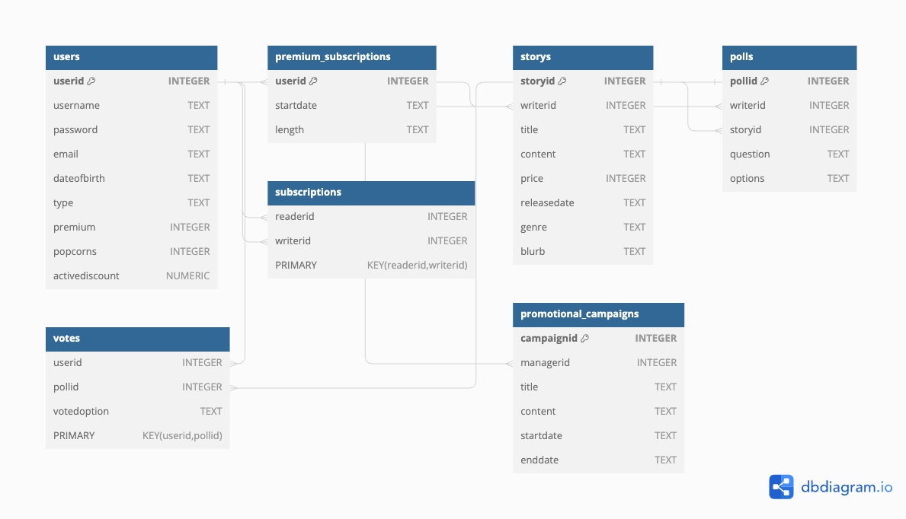

# Stories From Steel City - Group 25

Steel city stories team 25 - web platform for sharing and writing stories related to Sheffield and its culture.

Table of Contents

* Team members and contributions
* Installation
* Login credentials for testing
* Database schema
* Implemented stories
* D
* Additional Information

Team Members

Adam Bentley - ace22ab:

Database design and implementation and work allowing for the controllers to communicate with the database. Error handling within controllers.

James Godfrey - ach22jg

Controller interactions with views. Testing.

Theo Johnson-Martin - acb22tj

Majority of HTML design and partial CSS

Myron Sukhanov - acl23ms

The majority of the CSS (accessibility, etc), database design & visualisation, documentation.

Jake Whiteley - jwhiteley2@sheffield.ac.uk

Nick Efe Oni - [neoni1@sheffield.ac.uk](mailto:neoni1@sheffield.ac.uk)

---

Installation

1. Navigate to `project/Steel-city/src/app.rb`.
2. Run `bundle install`.
3. Run `sinatra app.rb`.

**The DB Schema**

# 

# **Stories**

Read the doc that is submitted via BlackBoard.

**Changes made from initial plan**

Priority shifted away from story inputs and towards ensuring the account system works. This is due to the requirements established upon database design as we realised that the user id would be a foreign key in most of the tables and therefore the user system needs to be established to allow for the others to be implemented.

**Testing:**

We have written 10 integration tests regarding the user account system. These tests ensure that the user account follows the requirements of the website and have 80% coverage of the code, mostly excluding redirects.
